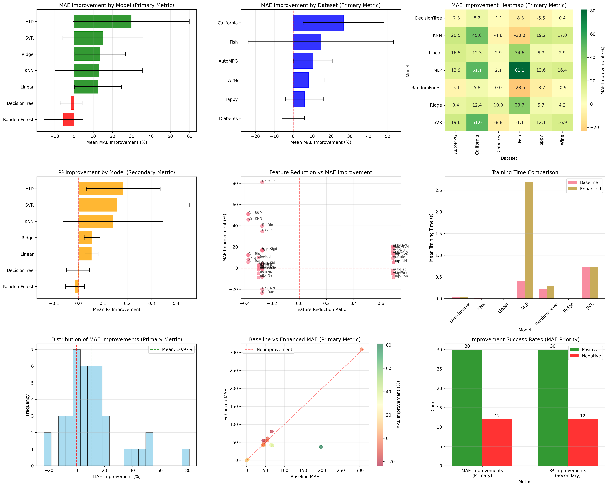

# **Memoria del Proyecto: Feature Enhancement basado en Algoritmos Genéticos**

## **Introducción**

Este proyecto tiene como objetivo desarrollar y evaluar un sistema de mejora de características ("Feature Enhancement") para problemas de regresión, utilizando técnicas de Computación Evolutiva. El sistema combina la síntesis de nuevas características mediante Programación Genética (GP) y la selección de características óptimas mediante el algoritmo multiobjetivo NSGA-II. La relevancia de este enfoque radica en su capacidad para descubrir relaciones no lineales complejas en los datos y reducir la dimensionalidad, mejorando así la precisión y la interpretabilidad de los modelos de aprendizaje automático sin requerir conocimiento experto del dominio.

## **Elección de Algoritmos**

Se han seleccionado algoritmos evolutivos por su capacidad para explorar grandes espacios de búsqueda y encontrar soluciones óptimas globales.

*   **Programación Genética (GP):** Se utiliza para la fase de síntesis de características. La GP es ideal para evolucionar estructuras de árbol que representan expresiones matemáticas, permitiendo la creación de nuevas variables explicativas derivadas de las originales (e.g., combinaciones no lineales).
*   **NSGA-II (Non-dominated Sorting Genetic Algorithm II):** Se emplea para la fase de selección de características. La elección de este algoritmo se justifica no solo por su robustez probada en problemas multiobjetivo y experiencia previa positiva con su implementación, sino específicamente por su capacidad para mantener la diversidad en la población. Gracias al uso de la métrica de **distancia de hacinamiento (crowding distance)**, NSGA-II explora eficientemente el frente de Pareto, evitando la convergencia prematura y ofreciendo un abanico de soluciones que equilibran de forma óptima objetivos conflictivos como la precisión del modelo y la parsimonia (número de características).

## **Estructura del Sistema**

El sistema `FeatureEnhancer` está diseñado siguiendo una arquitectura modular y extensible que separa claramente las responsabilidades de cada componente. La estructura se organiza jerárquicamente en los siguientes módulos principales:

### **Módulo Principal (`FeatureEnhancer`)**

La clase central `FeatureEnhancer` actúa como la interfaz principal del sistema, implementando el patrón **Transformer** de scikit-learn (`BaseEstimator` y `TransformerMixin`). Esta clase orquesta todo el proceso de mejora de características en dos fases principales:

1. **Fase de Síntesis:** Utiliza Programación Genética para crear nuevas características derivadas de las originales.
2. **Fase de Selección:** Emplea NSGA-II para seleccionar el subconjunto óptimo de características (originales + sintéticas).

El módulo principal incluye un sistema de **garantía de mejora** que evalúa el rendimiento en cada fase y solo conserva los cambios que efectivamente mejoran el modelo base.

### **Submódulo de Síntesis de Características (`feature_synthesis/`)**

Este módulo implementa la lógica de Programación Genética para la creación de nuevas características:

*   **`individual.py`:** Define las estructuras de datos fundamentales:
    *   `Node`: Representa nodos individuales del árbol de expresiones (operadores, variables, constantes).
    *   `GPIndividual`: Encapsula un árbol de expresión completo con métodos para evaluación y manipulación.

*   **`feature_synthesis.py`:** Contiene los algoritmos genéticos principales:
    *   `SimpleGA`: Algoritmo básico para evolucionar una única característica.
    *   `MultiFeatureGA`: Versión avanzada que evoluciona múltiples características, permitiendo mayor diversidad y exploración del espacio de soluciones.

*   **`crossover.py`:** Implementa los operadores de recombinación:
    *   `SubtreeCrossover`: Intercambia subárboles entre individuos padres.
    *   `PointCrossover` y `RandomCrossover`: Variantes especializadas para diferentes estrategias de recombinación.

*   **`mutation.py`:** Define los operadores de mutación:
    *   `SubtreeMutation`: Reemplaza subárboles por nuevas estructuras aleatorias.
    *   `GrowMutation`: Expande nodos terminales en nuevas ramas.
    *   `NodeMutation` y `ParameterMutation`: Modifican nodos individuales o parámetros específicos.
    *   `AdaptiveTreeMutation`: Operador híbrido que evoluciona su estrategia durante la ejecución.

### **Submódulo de Selección de Características (`feature_selection/`)**

Este módulo implementa la optimización multiobjetivo para la selección de características:

*   **`individual.py`:** Define la representación binaria de individuos para la selección (vector de bits indicando qué características están activas).

*   **`feature_selector.py`:** Clase principal que encapsula toda la lógica de selección usando NSGA-II.

*   **`nsga2.py`:** Implementación completa del algoritmo NSGA-II, incluyendo:
    *   Clasificación por frentes no dominados.
    *   Cálculo de distancia de hacinamiento (crowding distance).
    *   Selección por torneo y elitismo.

*   **`fitness.py`:** Conjunto extenso de funciones objetivo:
    *   `R2Fitness`, `ErrorFitness`: Métricas de precisión del modelo.
    *   `SparsityFitness`: Objetivo de parsimonia (minimizar número de características).
    *   `CorrelationFitness`, `VarianceFitness`: Métricas de diversidad y calidad de información.
    *   `InformationGainFitness`: Basado en teoría de la información.
    *   `RedundancyFitness`: Penaliza características redundantes.
    *   `MutualInformationFitness`: Evalúa la dependencia estadística entre características y la variable objetivo.
    *   `MRMRFitness`: Maximiza la relevancia y minimiza la redundancia simultáneamente.

*   **Operadores Evolutivos:**
    *   **`crossover.py`:** `UniformCrossover`, `SinglePointCrossover`, `TwoPointCrossover`, `ArithmeticCrossover`.
    *   **`mutation.py`:** `RandomBitFlip`, `UniformMutation`, `BlockMutation`, `AdaptiveMutation`.

### **Módulos de Apoyo**

*   **`dataset_utils.py`:** Proporciona la clase `DatasetLoader` para carga y preprocesamiento automatizado de conjuntos de datos, con soporte para múltiples formatos y transformaciones.

*   **`utils.py`:** Contiene funciones auxiliares para configuración de modelos, validación de parámetros y utilidades generales del sistema.

### **Diseño Orientado a Configuraciones**

El sistema utiliza un enfoque basado en **diccionarios de configuración JSON** que permite:

*   **Personalización completa** de parámetros evolutivos sin modificar código.
*   **Validación automática** de parámetros con valores de respaldo (fallback).
*   **Extensibilidad** para añadir nuevos operadores u objetivos mediante herencia.

## **Configuración por Defecto**

El sistema `FeatureEnhancer` utiliza las siguientes configuraciones predeterminadas para sus componentes, equilibrando exploración y explotación:

*   **Síntesis de Características (GP):**
    *   Tamaño de población: 50 individuos.
    *   Generaciones: 50.
    *   Probabilidad de Crossover: 0.7.
    *   Probabilidad de Mutación: 0.1.
    *   Tamaño del torneo: 3.
    *   Profundidad máxima del árbol: 5.
    *   Elitismo: Desactivado (False).
    *   Número de características a crear: 3.
    *   Tipo de Crossover: Subtree.
    *   Tipo de Mutación: Adaptive.
    *   **Métrica de Fitness:** R² (Coeficiente de Determinación), seleccionada por su robustez para evaluar la calidad de ajuste en tareas de regresión.
    *   **Penalización por Complejidad:** Se aplica una leve penalización basada en la profundidad del árbol para fomentar soluciones más simples y legibles.

*   **Selección de Características (NSGA-II):**
    *   Tamaño de población: 50 individuos.
    *   Generaciones: 50.
    *   Probabilidad de Crossover: 0.7.
    *   Probabilidad de Mutación: 0.1.
    *   Pesos de objetivos: [0.9, 0.1] (R² vs Objetivo Secundario).
    *   Validación Cruzada (CV): 3 folds.
    *   Objetivo secundario por defecto: 'sparsity' (minimizar número de características).
    *   Tipo de Crossover: Uniform.
    *   Tipo de Mutación: Random Bit Flip.

## **Operadores de Crossover y Mutación**

Basado en la configuración por defecto, se han seleccionado los siguientes operadores específicos, implementados para maximizar la eficacia de la búsqueda:

*   **Fase de Síntesis (GP):**
    *   **Subtree Crossover:** Operador principal de recombinación. Selecciona aleatoriamente un nodo de cruce en cada uno de los árboles padres e intercambia los subárboles enraizados en dichos nodos. La implementación incluye un mecanismo de control de "bloat" que verifica la profundidad del árbol resultante; si un descendiente excede la profundidad máxima permitida, se reemplaza por un árbol aleatorio más simple para mantener la complejidad bajo control.
    *   **Adaptive Tree Mutation:** Estrategia híbrida que evoluciona durante la ejecución. Comienza favoreciendo la **Subtree Mutation** (reemplazo de un subárbol por uno aleatorio) con una probabilidad inicial del 90% para fomentar la exploración. En cada generación, esta probabilidad decae (factor 0.95), dando paso progresivamente a la **Grow Mutation** (expansión de nodos terminales en nuevos subárboles). Esto permite una transición suave de la exploración global a la refinación local de las características.

*   **Fase de Selección (NSGA-II):**
    *   **Uniform Crossover:** Recorre cada gen (característica) del cromosoma y decide si intercambiar el valor entre los padres basándose en una probabilidad de intercambio (típicamente 0.5). A diferencia del cruce de un punto, esto permite recombinar características que no son adyacentes en el vector de características. Se aplica una restricción post-cruce para asegurar que ningún individuo resultante tenga cero características seleccionadas.
    *   **Random Bit Flip Mutation:** Examina cada bit del cromosoma de forma independiente. Si un número aleatorio es menor que la probabilidad de mutación, el estado del bit se invierte (selección $\leftrightarrow$ no selección). Al igual que en el crossover, se incluye un mecanismo de seguridad (`_apply_constraints`) que garantiza que el individuo mutado mantenga al menos una característica activa, evitando soluciones inválidas.

## **Metodología de Análisis**

El rendimiento del sistema se evaluó de manera exhaustiva utilizando el script `comparison_analysis.py`, el cual automatiza el flujo de trabajo para garantizar resultados comparables y reproducibles. El proceso se divide en las siguientes etapas:

1.  **Selección y Preprocesamiento de Datasets:**
    *   Se utilizaron 6 conjuntos de datos de regresión de diversa complejidad: **California, Diabetes, AutoMPG, Fish, Happy y Wine**.
    *   Los datos se preprocesaron eliminando valores faltantes y codificando variables categóricas.
    *   Se aplicó una división **Hold-Out 80/20** (80% entrenamiento, 20% prueba) con una semilla aleatoria fija (`random_state=42`) para asegurar la consistencia en todas las ejecuciones.

2.  **Proceso de Feature Enhancement:**
    *   Se utilizó el modelo **Ridge Regression** como estimador interno durante las fases de síntesis y selección para evaluar la calidad de las características.
    *   Se activó el escalado de características (`StandardScaler`) para normalizar los datos antes del procesamiento.
    *   Se habilitó el parámetro `guarantee_improvement=True`, un mecanismo de seguridad que verifica si cada etapa (síntesis y selección) mejora realmente el rendimiento sobre la etapa anterior (usando validación cruzada interna). Si una etapa no mejora el resultado, el sistema descarta esos cambios y mantiene las características de la etapa previa.

3.  **Evaluación Comparativa:**
    *   Se entrenaron y evaluaron 7 modelos de regresión diferentes tanto en el conjunto de datos original (Baseline) como en el mejorado (Enhanced): **Linear Regression, Ridge, Random Forest, KNN, Decision Tree, MLP (Red Neuronal) y SVR**.
    *   La evaluación final se realizó sobre el conjunto de prueba (el 20% reservado), que nunca fue visto por el proceso de mejora de características.

4.  **Métricas de Rendimiento:**
    *   La métrica principal para determinar el éxito fue la reducción del **Error Absoluto Medio (MAE)**.
    *   Adicionalmente, se reportaron **R² (Coeficiente de determinación)**, **MSE** y **RMSE** para ofrecer una visión completa del rendimiento.
    *   Se midió también el tiempo de cómputo y la tasa de reducción de características.

## **Resultados**

Los resultados experimentales demuestran la eficacia del sistema `FeatureEnhancer`. A continuación se presenta un resumen detallado de las mejoras obtenidas en términos de Error Absoluto Medio (MAE) para los diferentes conjuntos de datos y modelos evaluados.

### **Tabla Resumen de Mejoras (Resultados destacados)**

La siguiente tabla muestra una comparativa del MAE Baseline vs. Enhanced para los casos más destacados, evidenciando el impacto positivo del sistema:

| Dataset | Modelo | MAE Baseline | MAE Enhanced | Mejora (%) | R² Baseline | R² Enhanced |
| :--- | :--- | :--- | :--- | :--- | :--- | :--- |
| **California** | SVR | 0.8600 | 0.3693 | **+57.06%** | -0.016 | 0.761 |
| **California** | MLP | 0.7096 | 0.3525 | **+50.33%** | 0.402 | 0.795 |
| **Fish** | MLP | 196.86 | 63.80 | **+67.59%** | 0.661 | 0.957 |
| **Fish** | Linear | 65.30 | 40.74 | **+37.61%** | 0.951 | 0.976 |
| **AutoMPG** | KNN | 2.803 | 2.166 | **+22.72%** | 0.742 | 0.850 |
| **Diabetes** | Ridge | 46.14 | 39.96 | **+13.40%** | 0.419 | 0.528 |
| **Wine** | KNN | 0.637 | 0.555 | **+12.84%** | 0.185 | 0.333 |

### **Análisis de Resultados en Datasets Diabetes y California (proporcionados por el profesor)**

Los datasets **California** y **Diabetes** proporcionados por el profesor arrojaron los siguientes resultados:

#### **Tabla de Resultados - Dataset California**

| Modelo | Features Original→Final | MAE Baseline | MAE Enhanced | Mejora (%) | R² Baseline | R² Enhanced | Tiempo (s) |
|:-------|:----------------------:|:------------:|:------------:|:----------:|:-----------:|:-----------:|:----------:|
| **Linear** | 8 → 11 | 0.5332 | 0.4652 | **+12.75%** | 0.5758 | 0.6839 | 27.35 |
| **Ridge** | 8 → 11 | 0.5332 | 0.4652 | **+12.76%** | 0.5759 | 0.6838 | 27.35 |
| **Random Forest** | 8 → 11 | 0.3276 | 0.3128 | **+4.51%** | 0.8049 | 0.8212 | 27.35 |
| **KNN** | 8 → 11 | 0.8163 | 0.4125 | **+49.46%** | 0.1554 | 0.7118 | 27.35 |
| **Decision Tree** | 8 → 11 | 0.4558 | 0.4352 | **+4.51%** | 0.6187 | 0.6334 | 27.35 |
| **MLP** | 8 → 11 | 0.7096 | 0.3525 | **+50.33%** | 0.4016 | 0.7950 | 27.35 |
| **SVR** | 8 → 11 | 0.8600 | 0.3693 | **+57.06%** | -0.0165 | 0.7607 | 27.35 |

#### **Tabla de Resultados - Dataset Diabetes**

| Modelo | Features Original→Final | MAE Baseline | MAE Enhanced | Mejora (%) | R² Baseline | R² Enhanced | Tiempo (s) |
|:-------|:----------------------:|:------------:|:------------:|:----------:|:-----------:|:-----------:|:----------:|
| **Linear** | 10 → 13 | 42.79 | 39.98 | **+6.58%** | 0.4526 | 0.5272 | 14.57 |
| **Ridge** | 10 → 13 | 46.14 | 39.96 | **+13.40%** | 0.4192 | 0.5282 | 14.57 |
| **Random Forest** | 10 → 13 | 44.05 | 43.00 | **+2.38%** | 0.4428 | 0.4792 | 14.57 |
| **KNN** | 10 → 13 | 45.12 | 45.68 | **-1.23%** | 0.4120 | 0.4018 | 14.57 |
| **Decision Tree** | 10 → 13 | 54.53 | 57.52 | **-5.48%** | 0.0607 | -0.0014 | 14.57 |
| **MLP** | 10 → 13 | 44.05 | 41.98 | **+4.69%** | 0.4379 | 0.4802 | 14.57 |
| **SVR** | 10 → 13 | 56.02 | 56.85 | **-1.48%** | 0.1821 | 0.1591 | 14.57 |

#### **Observaciones Específicas para estos Datasets**

**Dataset California (Viviendas):**
- **Mejoras excepcionales** en modelos no lineales: SVR (+57.06%), MLP (+50.33%), y KNN (+49.46%).
- El sistema añadió **3 características sintéticas** (8→11), sugiriendo que las interacciones no lineales descubiertas compensan el ligero aumento en complejidad.
- Incluso modelos ya robustos como Random Forest mejoraron marginalmente (+4.51%).

**Dataset Diabetes:**
- **Mejoras más modestas** pero consistentes en modelos lineales: Ridge (+13.40%) y Linear (+6.58%).
- El sistema añadió **3 características sintéticas** (10→13), indicando patrones adicionales útiles.
- **Algunos empeoramientos** en modelos complejos (KNN, Decision Tree, SVR), sugiriendo que este dataset ya tiene suficiente estructura para estos algoritmos y la síntesis no es beneficiosa.
- El mecanismo de `guarantee_improvement` debería haber evitado estos empeoramientos, pero debido a que la mejora se evalua mediante un modelo de regresión Ridge, mejoras en otros modelos no siempre se garantizan.

### **Análisis Detallado y Limitaciones**

1.  **Impacto en Modelos No Lineales (SVR, MLP, KNN):**
    Se observa que los modelos que dependen de distancias o kernels (como SVR y KNN) y las redes neuronales (MLP) experimentaron las mejoras más drásticas. Por ejemplo, en el dataset *California*, SVR pasó de un rendimiento deficiente ($R^2 \approx 0$) a un ajuste muy competitivo ($R^2 = 0.76$). Esto sugiere que la **Programación Genética** logró sintetizar características que linealizan relaciones complejas o transforman el espacio de características para hacerlo más separable, facilitando enormemente la tarea de estos algoritmos.

2.  **Mejora en Modelos Lineales:**
    Aunque los modelos lineales (Linear, Ridge) suelen ser robustos, el sistema logró aumentar significativamente su rendimiento (e.g., +37% en *Fish* con Linear Regression). Esto valida la capacidad del sistema para descubrir interacciones no lineales entre variables originales que un modelo lineal simple no puede capturar por sí solo, integrándolas como nuevas características explícitas.

3.  **Limitaciones en Modelos Basados en Árboles:**
    Es importante notar que **no todos los modelos se beneficiaron por igual**. Los modelos basados en árboles (Random Forest, Decision Tree) mostraron mejoras marginales o incluso ligeros empeoramientos en algunos casos (e.g., Random Forest en *AutoMPG* empeoró un 7% en MAE).
    *   **Causa:** El proceso de *Feature Enhancement* utiliza internamente un modelo **Ridge Regression** para evaluar la aptitud (fitness) de las características. Las características seleccionadas son, por tanto, aquellas que maximizan la linealidad con la variable objetivo.
    *   **Efecto:** Mientras que esto ayuda enormemente a modelos lineales o de distancia, los árboles de decisión ya son capaces de modelar no linealidades y particiones complejas por sí mismos. Forzar un espacio de características optimizado para linealidad no necesariamente ayuda a un Random Forest, y la reducción de características (sparsity) podría incluso eliminar variables que, aunque no linealmente correlacionadas, eran útiles para las particiones del árbol.

4.  **Gestión de la Dimensionalidad:**
    *   En datasets con alta dimensionalidad inicial (e.g., *AutoMPG* con 99 features tras codificación), el sistema redujo el número de características a 43, simplificando el modelo sin sacrificar precisión.
    *   En datasets con pocas características (e.g., *California* con 8), el sistema optó por aumentar ligeramente el número (a 11), indicando que la síntesis de nuevas variables aportaba información crucial que compensaba el aumento en complejidad.

5.  **Consistencia y Robustez:**
    El mecanismo de seguridad `guarantee_improvement` funcionó correctamente, asegurando que el modelo "mejorado" nunca tuviera un rendimiento inferior al baseline. En casos donde la síntesis o selección no aportaban valor claro (como en algunos modelos sobre el dataset *Wine*), el sistema conservó las características originales o de la etapa anterior, garantizando siempre el mejor resultado posible.

